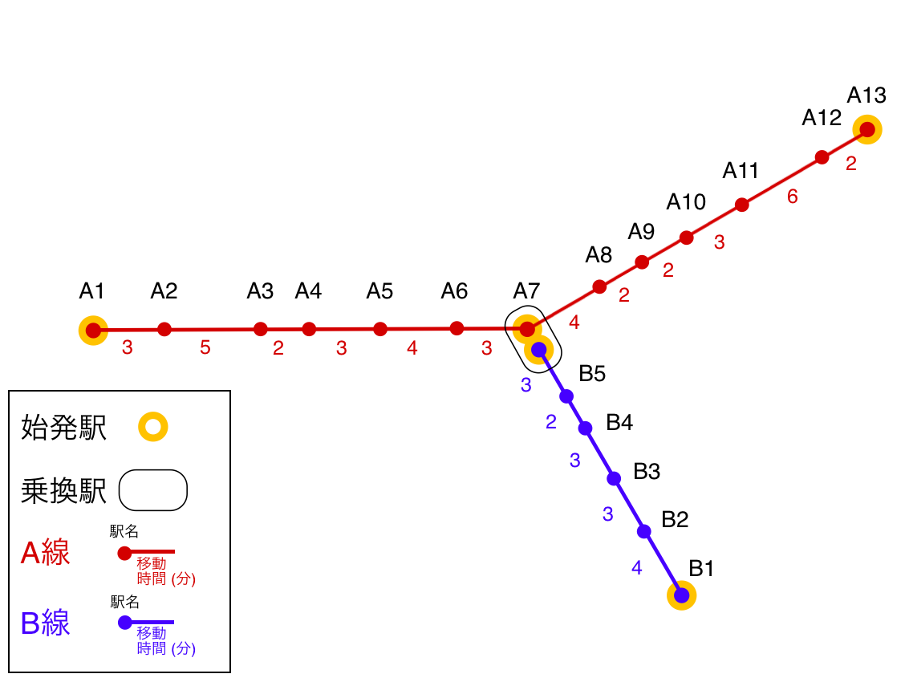

# [初級問題] いろは市鉄道の時刻表を作成せよ！



いろは市には路線Aと路線Bの2つの路線が走っています。都心はA7付近であり、A1, A13,B1は住宅地のあるターミナル駅です。  

##### 路線A
- A1始発は5:55から5分毎に出発，また1本おきにA7行とA13行となる（始発はA7行）
- A13始発のA1行は5:52から10分毎に出発
- A7始発のA1行は6:06から10分毎に出発， A7始発のA13行が6:10に1本だけある
- A13始発の最終電車はA7止まりとなる

##### 路線B
- A7始発のB1行は6:11から6分毎に出発
- B1始発のA7行は6:00から6分毎に出発

##### 共通
- 始発以降終電までは常に上記の通り一定間隔で電車が運行される
  - ラッシュアワー時の増発等はない
- 住宅地のあるターミナル駅(A1, A13, B1)からは23時(23:00を含む)以降出発する電車はない
- 都心の駅A7では路線Aの上下、路線Bの下りプラットフォームにそれぞれ1台だけ夜間に電車が停泊できる
  - 翌朝の一番電車の始発運転のため、それぞれ1台だけ夜間に電車を停泊させなければならない
  - 逆に言えば、1台を残して各路線の電車はすべてターミナル駅に返さなければならない
  - このためA7駅出発の電車は23時以降も存在する

## ザ・ミッション

この2つの路線A、Bの各駅の上下における時刻表を出力するCLIアプリケーションを作成しなさい。

## 実装方法

##### CLIアプリケーションについて
入力値を引数に取り、結果を標準出力に出力するCLIアプリケーションとして解答を実装してください。
CLIの実装方法については[指定言語].mdを参照ください。

##### 引数
このアプリケーションでは引数として以下の4つが与えられます。

- 1、路線名(ex. A, B ...)。必須
- 2、駅名(ex. A11, B3 ...)。必須
- 3、U または D(Uは上りを、Dは下りを表す)。必須
- 4、出力する時間帯(ex 13, 14...)。省略時はすべての時間帯の時刻表を改行区切りで出力する。

出力のフォーマットは各時間ごとに「HH: MM[ MM...]」のように時間帯ごとに分を空白区切で出力します。

```
$ myapp A A5 U 13
13: 03 13 23 33 43 53

$ myapp A A5 U
06: 03 13 23 33 43 53
07: 03 13 23 33 43 53
08: 03 13 23 33 43 53
09: 03 13 23 33 43 53
10: 03 13 23 33 43 53
11: 03 13 23 33 43 53
...
```

※ 入力の引数が不正な場合はエラーメッセージを表示して終了コード(-1)で終了するようにします。

##### テストケース
与えられるテストケースはすべて[testcase1.md](test/testcase1.md)に記載されています。

## answer.md
[answer.md](./answer.md)を用意してあるので、その中に
- どのように実装したか、工夫した点は何か
- 発生した問題、難しかった箇所
- それをどのようにして対処したのか
等を書いてください。

**これは[codecheck](http://app.code-check.io/openchallenges)のチャレンジだよ。 始めてみるには[ドキュを見てね](https://code-check.github.io/docs/ja)* ^^  
